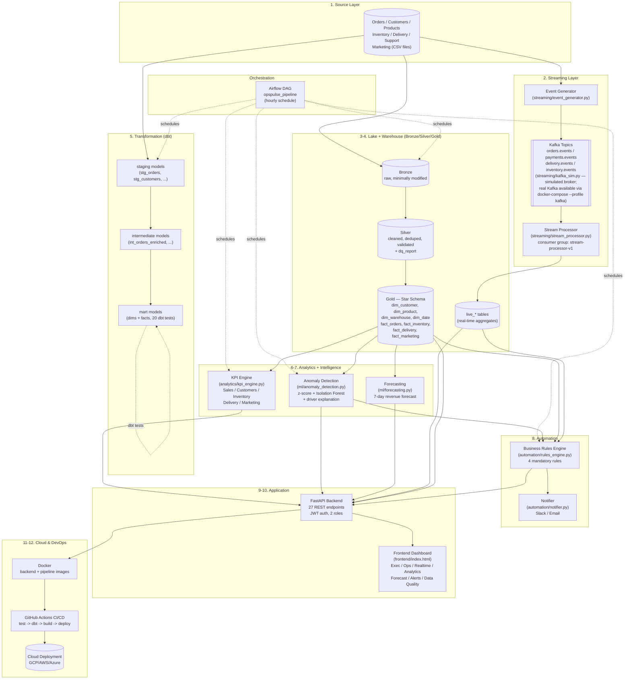
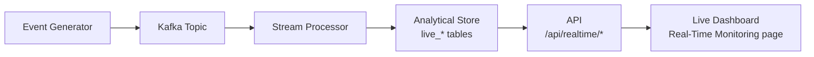

# OpsPulse 360 — Architecture Diagram

## End-to-end flow

## Minimum streaming demonstration (assignment §6)

## Notes on substitutions made in this build

| Required (assignment) | Used in this build | Why |
|---|---|---|
| Apache Kafka | `streaming/kafka_sim.py` (SQLite-backed broker with topics, producer/consumer API, offset commits, consumer groups) | No Kafka cluster available in the build sandbox. Real Kafka + Zookeeper are included in `docker/docker-compose.yml` under the `kafka` profile — swap `kafka_sim.py` for `kafka-python`/`confluent-kafka` pointed at `kafka:9092`; the rest of the pipeline (event schemas, consumer logic) does not change. |
| BigQuery / Snowflake | SQLite (`data/opspulse.db`) for the app; DuckDB (`data/opspulse_dbt.duckdb`) for the dbt project | Zero-setup, file-based, fully SQL-compatible. dbt models are portable — change `profiles.yml` to a `snowflake`/`bigquery` target and the SQL runs unmodified in production. |
| Airflow (running scheduler) | DAG file written and syntax-validated (`airflow/dags/opspulse_pipeline_dag.py`); Airflow service included in `docker-compose.yml` under the `airflow` profile | No standalone Airflow metadata DB/scheduler in the build sandbox. The DAG calls the exact scripts that were run and tested directly. |
| GCS / S3 | Local `data/` directory (raw CSVs = bronze landing zone) | Same "immutable raw storage" role; swapping to a bucket is a path change in `bronze/load_bronze.py`. |
