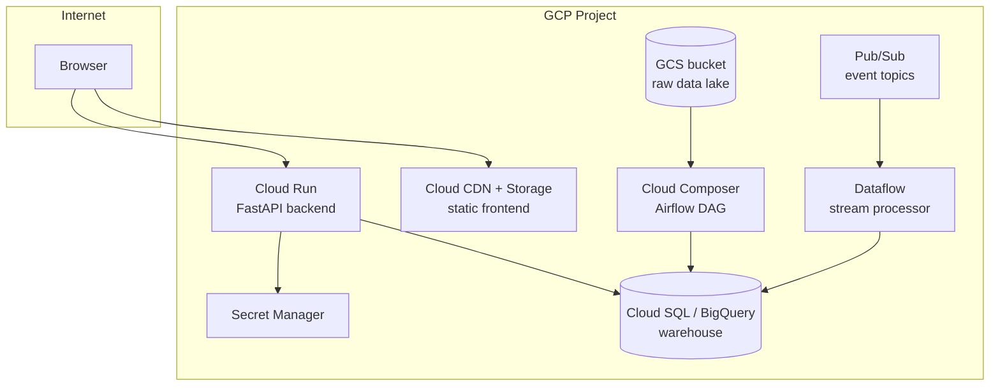

# OpsPulse 360 — Cloud Architecture & Estimated Cost

This document describes how the local build in this repo maps onto a
real cloud deployment, and gives a rough monthly cost estimate for a
small-scale production deployment (the scale this synthetic dataset
represents: ~20K orders, ~3K customers, ~600 products).

## Target architecture (GCP reference; AWS/Azure equivalents noted)

| Component | GCP service | AWS equivalent | Azure equivalent |
|---|---|---|---|
| Event streaming | Cloud Pub/Sub, or self-managed Kafka on GKE | Amazon MSK / Kinesis | Event Hubs |
| Stream processing | Dataflow (Apache Beam) | Kinesis Data Analytics / EMR | Stream Analytics |
| Raw data lake | Cloud Storage (GCS) | S3 | ADLS Gen2 |
| Data warehouse | BigQuery | Redshift / Snowflake | Synapse Analytics |
| Transformation | dbt Cloud or dbt-core on Cloud Run/Composer | same | same |
| Orchestration | Cloud Composer (managed Airflow) | MWAA | Data Factory |
| ML training/serving | Vertex AI (or plain scikit-learn on Cloud Run) | SageMaker | Azure ML |
| Backend API | Cloud Run (containerized FastAPI) | ECS Fargate / App Runner | Container Apps |
| Frontend | Cloud Storage + Cloud CDN (static) or Cloud Run | S3 + CloudFront | Static Web Apps |
| Secrets | Secret Manager | Secrets Manager | Key Vault |
| CI/CD | GitHub Actions -> Cloud Build/Deploy | GitHub Actions -> CodeDeploy | GitHub Actions -> Azure DevOps |
| Notifications | Pub/Sub -> Cloud Functions -> Slack/Email | SNS + Lambda | Logic Apps |

## Deployment diagram

## This repo's local build vs. the cloud target

| Local (this repo) | Cloud equivalent | Migration effort |
|---|---|---|
| `streaming/kafka_sim.py` | Pub/Sub or MSK | Swap client library; topic/consumer-group concepts map 1:1 |
| `data/opspulse.db` (SQLite) | BigQuery / Cloud SQL | Change connection string; SQL is largely portable |
| `data/opspulse_dbt.duckdb` + dbt-duckdb | BigQuery + dbt-bigquery | Change `profiles.yml` target only — model SQL unchanged |
| `airflow/dags/*.py` (unexecuted DAG file) | Cloud Composer | Deploy the same DAG file as-is |
| `docker/Dockerfile.backend` | Cloud Run container | `gcloud run deploy` from the same image |
| `frontend/index.html` | GCS static hosting + CDN | Direct upload, point `API_BASE` at the Cloud Run URL |
| `automation/notifier.py` (env-var driven) | Same code, env vars set via Secret Manager | No code change |

## Estimated monthly cost (small scale: single region, low traffic)

These are rough, illustrative estimates for a proof-of-concept /
low-traffic production deployment — not a quote. Actual cost depends
heavily on data volume, query patterns, and traffic.

| Component | Assumption | Est. monthly cost (USD) |
|---|---|---|
| BigQuery storage | ~5 GB warehouse | ~$0.10 |
| BigQuery queries | ~50 GB scanned/month (dashboard + dbt runs) | ~$0.30 (on-demand pricing, first 1 TB/mo often free-tier) |
| Cloud Run (backend) | 1 instance, low traffic, scales to zero | ~$5–15 |
| Cloud Storage (frontend + lake) | ~10 GB | ~$0.25 |
| Pub/Sub | ~1M messages/month | ~$0 (within free tier) or ~$5 |
| Cloud Composer (Airflow) | smallest environment | ~$300+ (this is the dominant cost — see note below) |
| Cloud CDN | low traffic | ~$1–5 |
| Secret Manager | a handful of secrets | ~$0 (free tier) |
| **Total (with managed Airflow)** | | **~$310–330/month** |
| **Total (Airflow replaced by Cloud Scheduler + Cloud Functions)** | | **~$10–25/month** |

**Cost optimization note (interview question §15 — "How would you
optimize warehouse/cloud cost?"):** the single biggest cost driver at
this scale is a managed Airflow environment (Cloud Composer), which
has a high fixed cost regardless of how small the DAG is. For a
pipeline this size (a handful of daily/hourly batch tasks), replacing
Composer with **Cloud Scheduler + Cloud Functions/Cloud Run jobs**
removes that fixed cost almost entirely and is the recommended setup
until the number of DAGs/dependencies grows enough to justify a full
orchestrator. Other cost levers: BigQuery partitioning/clustering on
`fact_orders` by date to reduce bytes scanned per query, Cloud Run
min-instances=0 (scale to zero when idle), and lifecycle rules on GCS
to move raw bronze data to Nearline/Coldline storage after 30–90 days.
